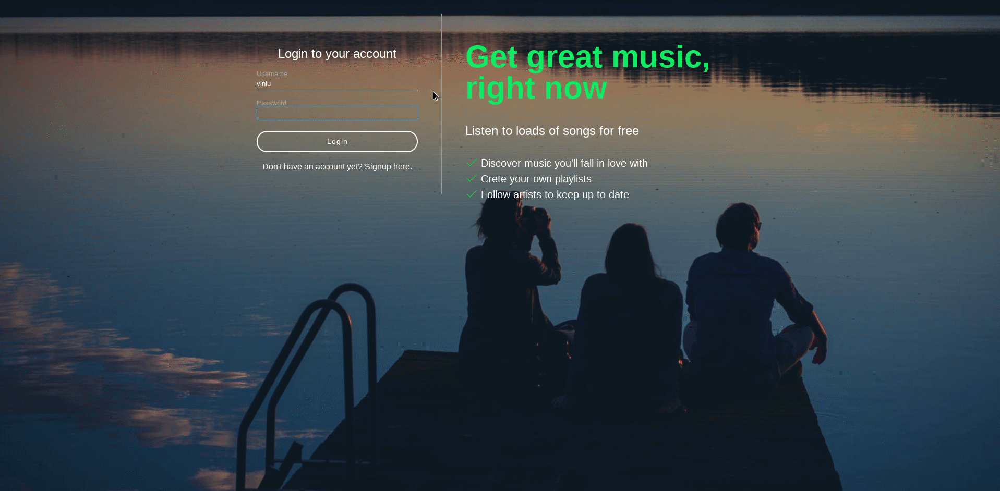

# What is this project?
This repository contains a spotify clone made in PHP.

## What i've learned?
- How to apply PHP Object Oriented on pratice
- Ajax
- Javascript audio/validations
- Php Validations

## Project

## Final thoughts
It was my first PHP big project. Even if i dont had finished the entire project, i learned the most essentials concepts of OOP by partice and it helped me a lot to work with php on the future.

## Special thanks
A special thanks to [@ReeceKenney](https://github.com/ReeceKenney) for sharing this awesome content and knowledge.
